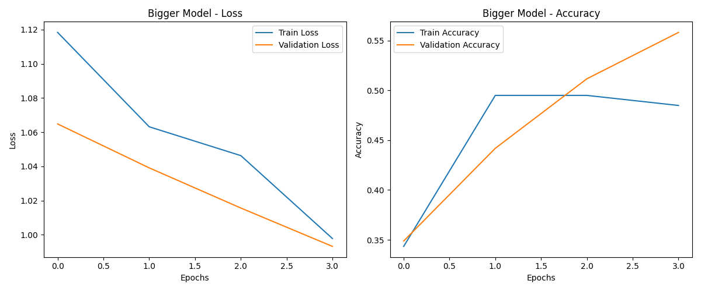

# Raport z laboratorium nr 3 - Klasyfikacja

## 1. Opis modeli
Do porównania zaimplementowane zostały dwa modele sekwencyjnych sieci neuronowych, z obiektu 
```tf.keras.Sequential```. Oba miały zbliżóną budowę, jednak drugi posiadał więcej neuronów na warstwach - dzięki temu za pomocą eksperymentu możliwe było sprawdzenie czy większa liczba neuronóœ poprawi dokładność predykcji.

### Model "Standard"
1. Warstwa wejść - 12 neuronów, aktywacja "relu".
2. Warstwa dropout z wartością parametru 0.2.
3. Warstwa typu "dense" z 12 neuronami i aktywacją 'relu'.
4. Warstwa wyjściowa, 3 neurony, aktywacja typu "softmax".

### Model "Powiększony (Bigger)" 
1. Warstwa wejściowa, 24 neurony, aktywacja "relu".
2. Warstwa dropout - j/w.
3. Warstwa typu "dense", 24 neurony, "relu".
4. Warstwa wyjściowa, j/w.

## 2. Wyniki

### Model "Standard"


Końcowa dokładność modelu wyniosła: 0.9355

### Model "Powiększony"


Końcowa dokładność modelu wyniosła: 0.5511

## 3. Dyskusja
Podczas opracowywania modeli dużym problemem okazało się uzyskanie powtarzalnych wyników pod względem wyjściowej dokładności pomiędzy sesjami treningowymi. W tym wypadku zaobserwowano lepszą powtarzalność wyników po ustawieniu stałych wartości ziarna dla generatorów np. podziału na grupy _train/test_ oraz dodanie warstwy Dropout.

Drugim zaobserwowanym problemem było uzyskanie powtarzalnej poprawy dokładności modelu z biegiem czasu. W tym wypadku wyniki znaczącą się poprawiły po lepszym dostosowaniu parametrów modelu (dokładnie ustawieniu typu loss na 'categorical_crossentropy'), normalizacji danych za pomocą scaler.fit_transform z obiektu StandardScaler pakietu sklearn oraz dodania parametru callback ustawionego na zatrzymywanie procesu uczenia jeśli przez więcej niż zadaną liczbę epok nie następuje poprawa dokładności.

Po tego rodzaju dostosowaniach, model Standard był w stanie przejść przez wszystkie 20 epok, realizując "książkową" krzywą wzrostu dokładności modelu i zadowalającą jak na prosty eksperyment końcową jej wartość na poziomie ok. 0.8. W przypadku modelu "Powiększonego" można z kolei zaobserwować tendencję do dużo skromniejszego wzrostu dokładności, który dodatkowo przy ustawionym poziomie cierpliwości na 4 epoki spowodował szybkie zakończenie eksperymentu z niezadowalającym wynikiem, pomimo ogólnie wzrostowej tendencji dokładności na danych walidacyjnych. Z powodu wspomnianego wzrostu dokładności inferencji na danych walidacyjnych, zdecydowano się na ponowienie procesu trenowania z wyłączonym parametrem callback.

> ### Model "Powiększony" - bez callback
> 
>
> Końcowa dokładność: 0.8372

Na podstawie tego i kilku dodatkowych, nieopisanych tutaj szczegółowo powtórzeń uruchomienia programu można zauważyć, że po wyłączeniu przedterminowego abortowania treningu, większy model był w stanie osiągnąć dużo lepsze wyniki, porównywalne do mniejszego modelu. Wydają się wypływać z tego dwa wnioski:
- Większy model charakteryzowała większa chaotyczność (entropia?) procesu uczenia się - model ma większą "skłonność" do niepoprawiania lub nawet pogarszania swojej dokładności pomiędzy rundami treningowymi.
- Uśredniając większy model cechował się nieco gorszą dokładnością po takiej samej liczbie epok treningowych niż mniejszy - to istotna informacja, która sprawia, że to mniejszy model jednoznacznie wydaje się być skuteczniejszy w przypadku danych o takiej wymiarowości (lub innych cechach), będąc przy tym oszczędniejszy obliczeniowo. 

Wniosek z punktu drugiego można skrótowo podsumować:
> _Większy (model) nie zawsze znaczy lepszy_

# Raport Laboratorium 4
Zebrano dane na temat efektywności modeli o następujących parametrach:
- 1 - 6 warstw typu relu.
- 1 - 13 neuronów.
- dropout Rate na warstwach drugiej (po warstwie danych wejściowych) i przedostaniej (przed warstwą danych wyjściowych) mógł wynieść: 0.1, 0.2 lub 0.3.
- learning rate mógł wynieść: 0.005, 0.01, 0.015, 0.02

Dane zebrano w tabeli zbiorczej w celu porównania z modelem z poprzednich zajęć.
 
Model baseline (z lab 3) miał następujące parametry:
# Standard
```
┌─────────────────────────────────┬────────────────────────┬───────────────┐
│ Layer (type)                    │ Output Shape           │       Param # │
├─────────────────────────────────┼────────────────────────┼───────────────┤
│ dense (Dense)                   │ (None, 13)             │           182 │
├─────────────────────────────────┼────────────────────────┼───────────────┤
│ dropout (Dropout)               │ (None, 13)             │             0 │
├─────────────────────────────────┼────────────────────────┼───────────────┤
│ dense_1 (Dense)                 │ (None, 12)             │           168 │
├─────────────────────────────────┼────────────────────────┼───────────────┤
│ dense_2 (Dense)                 │ (None, 3)              │            39 │
└─────────────────────────────────┴────────────────────────┴───────────────┘
```
> accuracy: 0.6164 
> loss: 0.9011 
> val_accuracy: 0.8125 
> val_loss: 0.8421

Dodatkowo, zaimplementowano także możliwość generacji modeli o wzrastającej i malejącej liczbie neuronów na każdej z warstw dense/relu, jednak test przeprowadzono wyłącznie na modelach o takiej samej liczbie neuronóœ.

W sumie, przetrenowano n = 468 struktur. Część z nich osiągnęła dokładność na danych testowych równą 100%, tych zdecydowano się nie brać dalej pod uwagę ze względu na możliwość, że zostały przetrenowane. Trening dla wszystkich wynosił 20 epok.

Najlepszym modelem, tj. takim o najwyżej, ale nierównej 100% dokładności oraz najniższej stracie okazał się ten o następujących parametrach:
liczba neuronów (na warstwach dense/relu) = 12
liczba warstw = 3
dropout rate = 0.1
learning rate = 0.02
**strata = 0.0481**
**dokładność = 0.944**